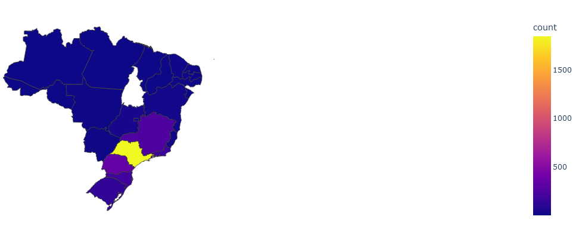
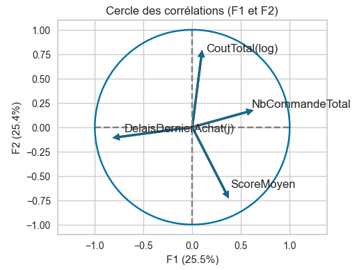
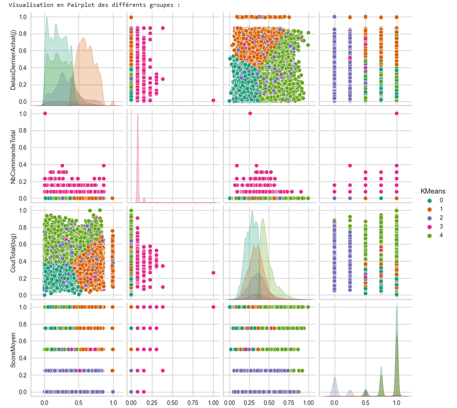
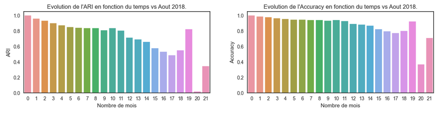
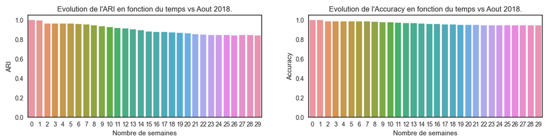
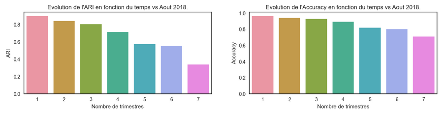

# 📊 Projet N°4 : Segmentation des clients d'un site e-commerce

## **📌 Contexte et Objectif**

**Entreprise :** Olist  
**Logo :** 

### **🎯 Objectif**
Fournir à l’équipe marketing d’Olist une segmentation des clients du site e-commerce pour optimiser les campagnes de communication.

### **📂 Jeux de données**
- **Données :** Base de données (lien vers la base de données, s'il y en a un)
- **Objectifs du projet :**
  - Analyser les comportements des utilisateurs et leurs données personnelles.
  - Fournir une description actionable des segments créés et de leur logique sous-jacente.
  - Proposer un contrat de maintenance basé sur l'évolution des segments au fil du temps.

---

## **🚀 Réalisations et Méthodologie**

### **1️⃣ Exploration des données**
- **Ouverture des données :** Analyse et fusion des fichiers pour préparer les données.
- **Création de nouvelles variables :** Transposition et dérivation de nouvelles variables telles que les types de paiement et les dates clés.

### **2️⃣ Analyse exploratoire**
- **Géolocalisation des acheteurs et des vendeurs :** Utilisation de la formule de **Harvesine** pour calculer la distance géographique.
  
  

- **Analyse de l’asymétrie des données :** Étude de la **Skew** pour comprendre la distribution des données.

  

### **3️⃣ Mise au point des clusters**
- **Variables utilisées pour la segmentation :** RFM (Récence achat, Fréquence, Montant)
- **Test d’ajout de variables supplémentaires :** Intégration du score client et analyse de l'impact sur la segmentation.
- **Visualisation de la corrélation entre les variables :** Utilisation du **cercle de corrélation** pour évaluer la pertinence des variables.
  
  

- **Choix du nombre de clusters :** Utilisation de la méthode **Elbow** pour déterminer le nombre optimal de clusters.
  
  

- **Analyse des clusters créés :** Observation des groupes clients issus du clustering et création de **Radar Charts** pour comparer les différents segments.
  
  

  - **Pairplot** : Analyse de la distribution des clients en fonction des différents groupes.
  
    

### **4️⃣ Simulation de la maintenance des clusters**
- **Création des définitions :** Séparation des étapes de nettoyage et création des **centroïdes**. Simulation de l’évolution des clusters au fil du temps (semaines, mois, trimestres).
  
- **Analyse de l'évolution des variables pertinentes sur différentes périodes :**
  - **Mois/mois** : Suivi de l’évolution des variables clés mois après mois.
  
    

  - **Semaines/semaine** : Analyse de l'évolution des segments semaine par semaine.
  
    

  - **Evolution des clusters** : Étude de l’évolution des clusters entre août 2018 et les périodes suivantes (semaine, mois, trimestre).
  
    

### **5️⃣ Analyse et conclusion**
- **Évolution des groupes** : En fonction du contrat de maintenance, analyse de la stabilité des clusters au fil du temps.
  
  

---

## **📈 Résultats et Insights**

### **🔎 Conclusions :**
- La segmentation permet de mieux cibler les clients et d’optimiser les campagnes marketing.
- Les clusters identifiés sont stables au fil du temps et peuvent être utilisés pour des prévisions futures.
- Le score client est un indicateur clé qui améliore la qualité des segments.

---

## **🛠️ Technologies et Outils Utilisés**

- **Langage :** Python 🐍
- **Librairies :** Pandas, Numpy, Seaborn, Matplotlib, KMeans, KNNImputer, Scikit-learn
- **Environnement :** Jupyter Notebook
- **Méthodes utilisées :** Clustering, Data cleaning, Data visualization, Machine learning

---

## **📬 Contact et Feedback**

💡 Ce projet a été réalisé dans le cadre de ma **formation Data Science**. N’hésitez pas à **laisser vos suggestions** ou à **me contacter** pour en discuter !  

📩 **Contact :**  
📧 [johan.rocheteau@hotmail.fr](mailto:johan.rocheteau@hotmail.fr)  
🔗 [LinkedIn](https://www.linkedin.com/in/johan-rocheteau)
