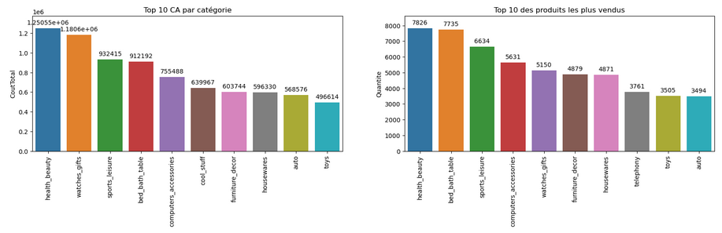
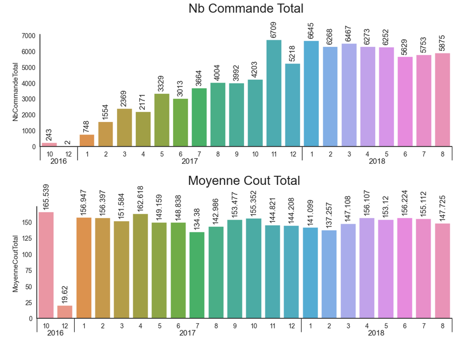
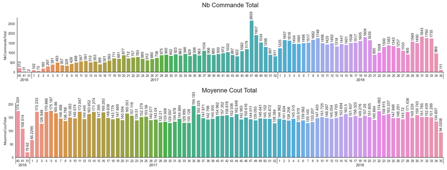
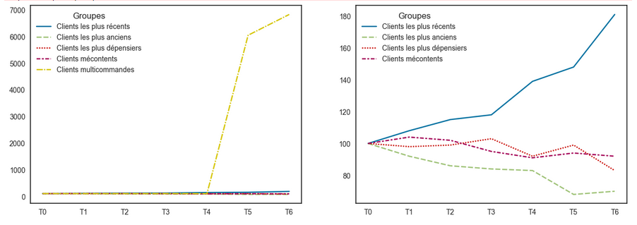

# Projet N°4 : Segmentez des clients d'un site e-commerce

## Mise en Situation :
- **Entreprise :** Olist
- **Logo :** 
- **But :** Fournir à ses équipes d'e-commerce une segmentation des clients qu’elles pourront utiliser au quotidien pour leurs campagnes de communication.
- **Jeux de données :** [Base de données](https://www.kaggle.com/olistbr/brazilian-ecommerce)
- **Objectifs :**
    - Comprendre les différents types d’utilisateurs grâce à leur comportement et à leurs données personnelles.
    - Fournir à l’équipe marketing une description actionable de votre segmentation et de sa logique sous-jacente pour une utilisation optimale
    - Fournir une proposition de contrat de maintenance basée sur une analyse de la stabilité des segments au cours du temps.

## Réalisations :
- **Librairies principales :** Pandas, Seaborn, Datetime, Numpy, KNNImputer, MinMaxScaler, StandardScaler
- **Etapes réalisées :**
    - **Exploration des données :**
      - Ouverture, analyse et merge des fichiers
      - Création de nouvelles variables ou transposition des données (Dates diverses, différents types de paiements ...)
      - Divers graphiques :
        
        
      - Etude de la géolocalisation des acheteurs et vendeurs et création d'une mesure de distance (Harvesine) :
        
        
      - Etude de l'assymétrie des données via **Skew** :
        
        
    - **Mise au point des clusters :**
        - Utilisation des variables RFM (Recence achat, Fréquence, Montant)
        - Différents tests d'ajout de variables supplémentaires et choix d'ajout du score client
        - Divers graphiques réalisés pour étayer l'analyse :
           

    - **Simulation de la maintenance des clusters :**
        - **Création de définitions :**
            - Toutes les étapes de nettoyage du notebook d'exploration en plusieurs définitions
            - Extraction des données (semaines ou mois)
            - création des centroides, modification des clusters, MinMaxscaler, KMeans pour ARI (différence entre les clusters X et X-1 ou -1 est le mois ou la semaine ou le trimestre précédent)
        - Etude de l'évolution des variables pertinantes mois/mois :
          
          
        - Etude de l'évolution des variables pertinantes semaines/semaines :
          
          
        - Evolution des clusters en semaine vs Août 2018 :
          
          
        - Evolution des clusters en mois vs Août 2018 :
          
          
        - Evolution des clusters en trimestre vs Août 2018 :
          
          
        - Evolution des groupes en fonction du contrat de maintenance :
          
             
  
