# Ecommerce-Customer-Segmentation-2023

Projet réalisé en 2023 dans le cadre de ma formation en Data Science.  
Objectif : segmenter les clients d’un site e-commerce (Olist) pour aider l’équipe marketing à personnaliser les campagnes de communication et à suivre l’évolution des comportements dans le temps.

## Objectifs

- Analyser les comportements d’achat et données client
- Créer une segmentation claire à l’aide de variables RFM
- Étudier la stabilité des segments dans le temps
- Proposer un contrat de maintenance adapté aux évolutions des clusters

## Données

- **Source** : [Kaggle – Brazilian E-Commerce Public Dataset](https://www.kaggle.com/olistbr/brazilian-ecommerce)

Les données comprennent :
- Informations client
- Commandes, paiements, livraisons
- Produits, vendeurs et localisation

## Méthodologie

### 1. Préparation des données

- Fusion des différentes tables de la base Olist
- Création de nouvelles variables : délais de livraison, distance client-vendeur (formule de Haversine), score client
- Analyse des distributions (skew) et nettoyage des données  
  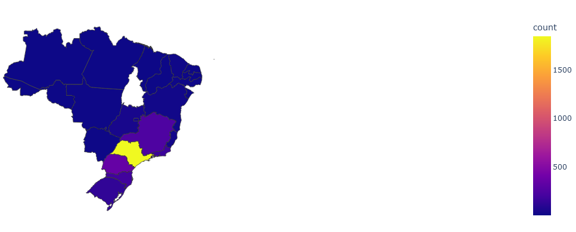  
  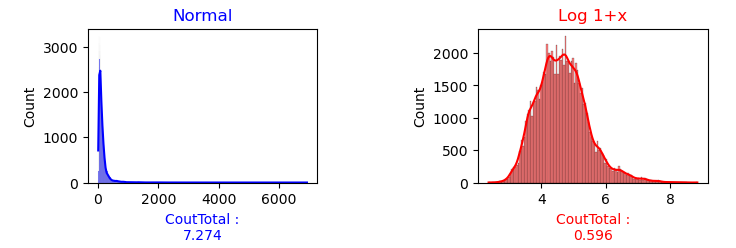

### 2. Segmentation des clients

- Segmentation RFM (Récence, Fréquence, Montant)
- Analyse de la corrélation entre variables  
  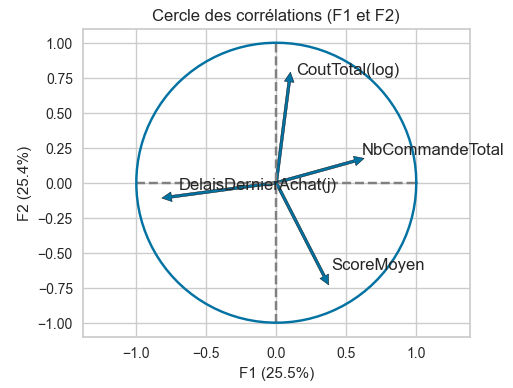

- Choix du nombre optimal de clusters via la méthode Elbow  
  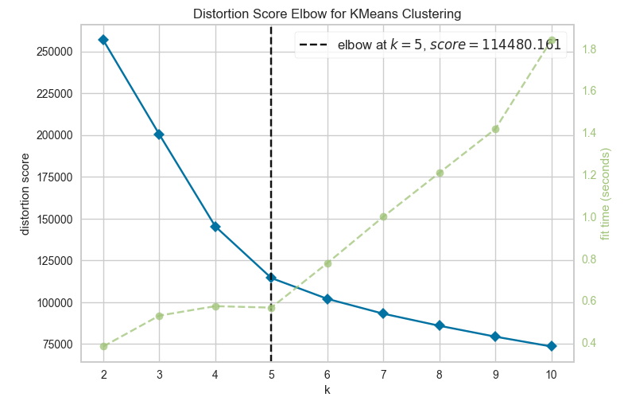

- Visualisation des segments :
  - Radar chart
  - Pairplot des groupes  
  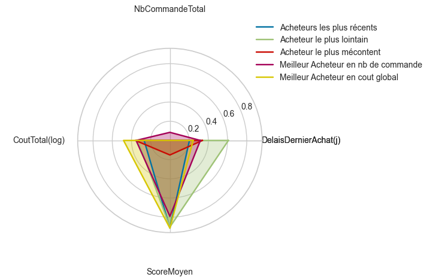  
  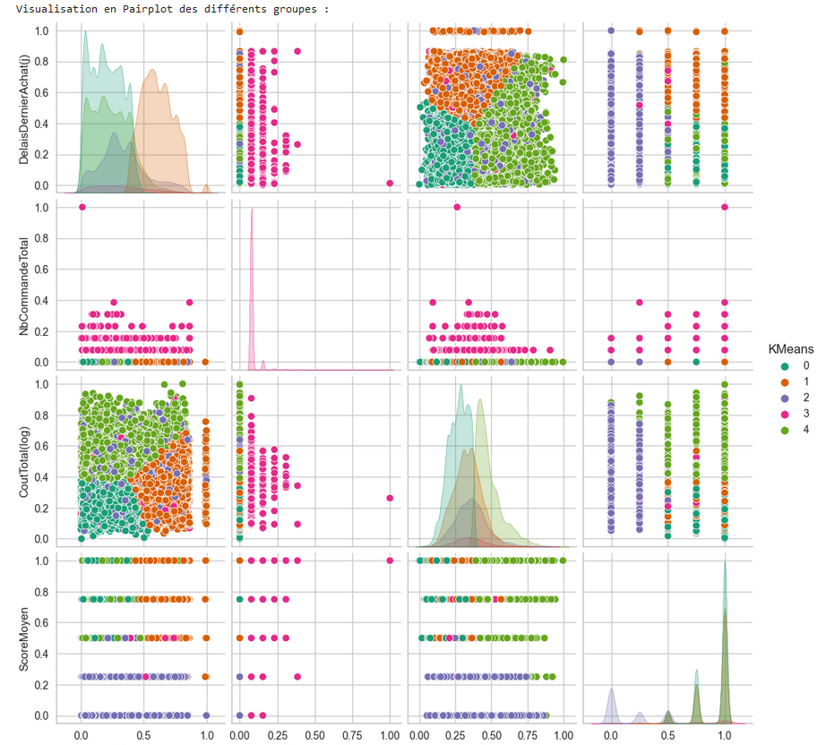

### 3. Suivi des clusters dans le temps

- Création des centroïdes initiaux
- Simulation de l’évolution des segments sur plusieurs périodes :
  - Semaine
  - Mois
  - Trimestre

  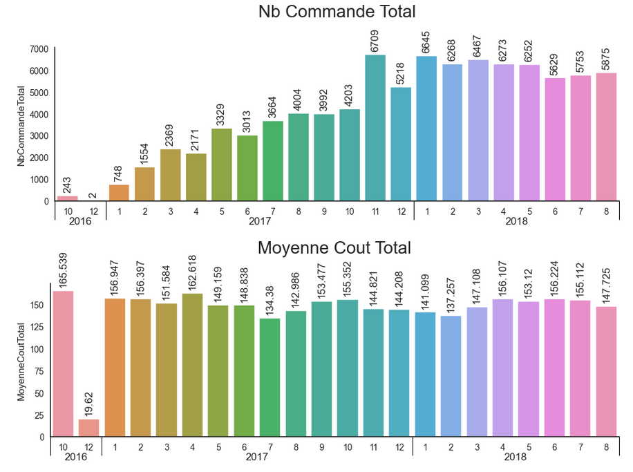  
  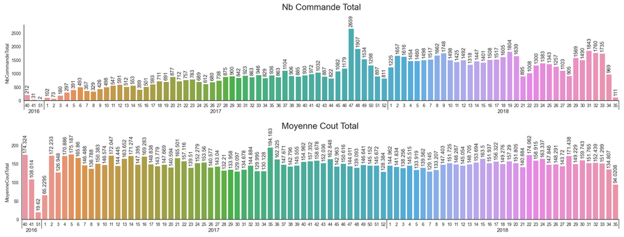  
  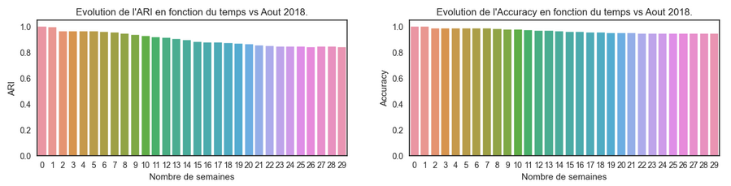  
  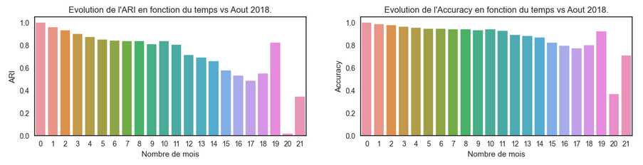  
  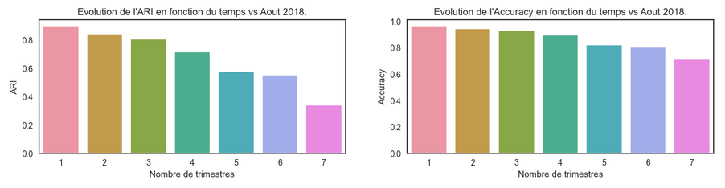

- Suivi de l’évolution des segments clients par score :
  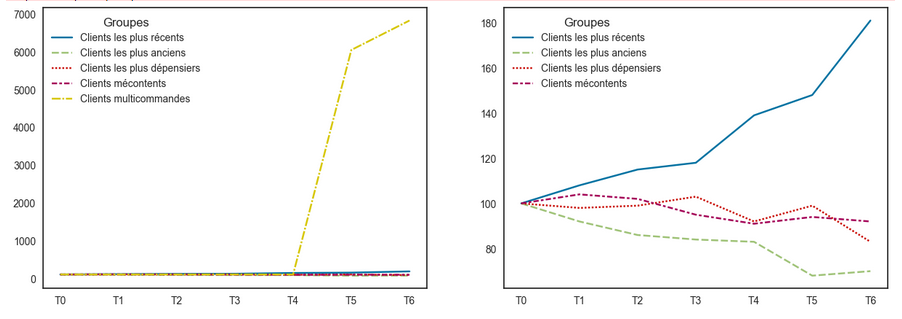

## Résultats

- Segmentation cohérente, utile pour des actions marketing ciblées
- Les clusters sont relativement stables dans le temps
- Le score client permet d’affiner les stratégies d’activation et de fidélisation
- Un suivi régulier permettrait d’adapter les campagnes selon les évolutions comportementales

## Technologies utilisées

- **Langage** : Python
- **Librairies** : pandas, numpy, matplotlib, seaborn, scikit-learn, KMeans, KNNImputer
- **Environnement** : Jupyter Notebook
- **Méthodes** : Clustering, Data cleaning, Data visualization, Feature engineering

## Contact

Projet réalisé en 2023 dans le cadre de ma formation en Data Science.  
Pour toute remarque ou question :

- **Email** : [johan.rocheteau@hotmail.fr](mailto:johan.rocheteau@hotmail.fr)  
- **LinkedIn** : [linkedin.com/in/johan-rocheteau](https://www.linkedin.com/in/johan-rocheteau)
